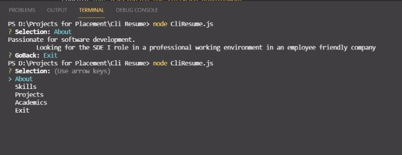

## CLI-Resume 📨
A command Line Interface Resume is created where you can access my RESUME.
-----------
### Overview 💥
- This is a fun project which gets you started with the world of javascript and the node modules
- I have used inquirer and child_process node modules while making this project.
-----------
### Preview ✨
- Below is the screenshot of the project and a video link of the working project is also provided.
[Click Here](https://drive.google.com/file/d/1gaEoWx26e5OP7yTcfAzwxeNciaXsE0jh/view?usp=sharing)  

-------------------
